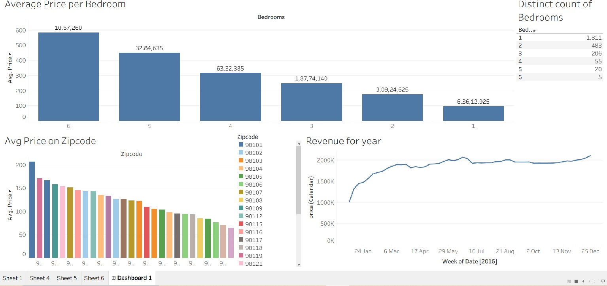

# Tableau Dashboard AirBnB Listing
This project has an interactive dashboard for AirBnb listing from dataset obtained from kaggle showcasing the performance rooms.

---

## 🛠 Tools & Technologies Used

- **Tableau**
- **Excel** (Initial inspection & cleaning)

---

## ✅ Basic Dashboard
- Average Price on Zipcode
- Year wise trend change of price
- Price over Time (Line Chart)
- Most revenue generating Bedroom type

---

## 🔍 Insights Derived

- **Rooms withs 1 Bedroom** has highest revenue 
- **Steep Price change** after 1st Qtr of 2016
- **Zipcode** gives clear picture with highest revenue area

---
## Tableau Public link

[Atul's Tableau Public Link](https://public.tableau.com/app/profile/atul.keshari/viz/AirBnbfullproject_17560600696210/Dashboard1?publish=yes)

---

## Dashboard Preview

